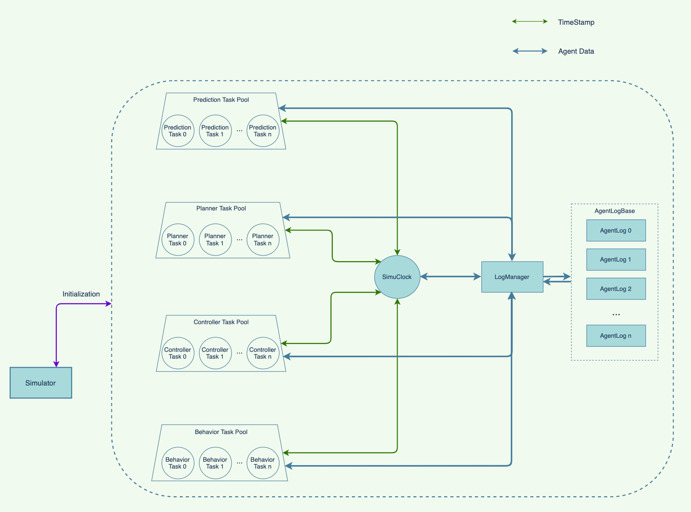

# **Cloud-based Autonomous Driving Simulation System Prototype**

This work is the system part (the other is algorithm part) of the UC-Berkeley's autonomous driving simulation system refactor Project. 

**CADSS** system is a multi-thread system that aggregate function modules (including prediction, planning and controlling) from each agent to multiple task pools, reduce agents' job to only perception and data interaction. Multiple task pools can be deployed on Cloud systems to realize the decentralized autonomous driving system. 

AgentLog is a database for each agent data with timestamp as primary key, LogContent as content. Multiple AgentLogs are stacked in the AgentLogBase with LogManager serving as the gate.

All tasks are decentralization, we put Tasks into corresponding Task Pool and they are individual autonomy* calculation unit which directly interact with System Clock(i.e., SimuClock), to retrieve or update the agents' data in AgentLog. 

All the Tasks and AgentLogs are initialized by outside controller Simulator, which enables researchers to monitor, modify and manipulate the insider system.

With the decentralization, the system has a better robustness and fault tolerance ability. Moreover, the implementation is easy to be deployed on Cloud-based systems for distributed calculation.

Currently, a demo-version of the prototype system is finished, ncluding implementation, structure design and system testing. The framework supports two kinds of simulation, Step Simulation and Real-time Simulation, developed on C++ with solid implementation.

* Explanation for autonomy: every task has its own applied algorithm and manager system to control its running and stopping, and also directly interact with LogManager for data transmission. 
